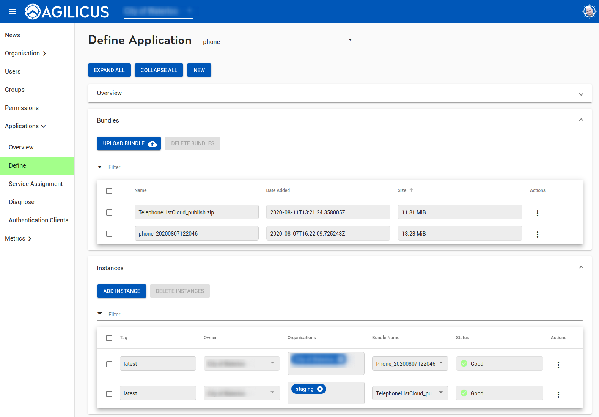

## Make the project
```
mkdir sample-dotnet-mvc-app
cd sample-dotnet-mvc-app
dotnet new console
```

Oberve that sample-dotnet-mvc-app.csproj has OutputType = EXE

```
<Project Sdk="Microsoft.NET.Sdk">

  <PropertyGroup>
    <OutputType>Exe</OutputType>
    <TargetFramework>netcoreapp1.1</TargetFramework>
  </PropertyGroup>

</Project>
```

## Make it Web MVC

```
dotnet new mvc
dotnet add package Microsoft.AspNetCore.Server.Kestrel
dotnet add package Microsoft.AspNetCore 

dotnet restore
```

## Setup Startup.cs

See [Startup.cs](Startup.cs) in this directory.

## Setup Program.cs

See [Program.cs](Program.cs) in this directory.

## Build a release

```
dotnet build -c release -o dist
```

Check the output: `dist/sample-dotnet-mvc-app.runtimeconfig.json`
```
{
  "runtimeOptions": {
    "tfm": "netcoreapp3.1",
    "framework": {
      "name": "Microsoft.NETCore.App",
      "version": "3.1.0"
    }
  }
}
```

Check the ouput: `dist/sample-dotnet-mvc-app.dll` is present.

Create the bundle:

```
cd dist
tag=$(date +%Y%m%d_%H%M%S)
echo "Will build sample-dotnet-mvc-app-$tag.zip"
zip -r ../sample-dotnet-mvc-app-$tag.zip *
cd ..
```

Now, use sample-dotnet-mvc-app-$tag.zip as the file to upload as an application bundle.
Assign it to the proper instance(s).



### Test it under Linux + Docker

```
$ docker run --rm -it -p 5000:5000 -v $PWD/dist:/app agilicus/dotnet
{ "time": "2020-08-13T19:49:35+00:00", "log": "dotnetcore: ENTRY="" set or runtimeconfig.json exists"}
{ "time": "2020-08-13T19:49:35+00:00", "log": "dotnetcore: is_dotnetcore return 0"}
{ "time": "2020-08-13T19:49:35+00:00", "log": "Assume dotnetcore runtime"}
{ "time": "2020-08-13T19:49:35+00:00", "log": "dotnetcore: chose ENTRY="sample-dotnet-mvc-app.dll" via runtimeconfig.json method"}
{ "time": "2020-08-13T19:49:35+00:00", "log": "Start dotnetcore for <<sample-dotnet-mvc-app.dll>>"}
{ "time": "2020-08-13T19:49:35+00:00", "log": "Start openresty"}

Agilicus sample-dotnet-mvc-app started

2020:08:13T19:49:35: STARTED
Hosting environment: Production
Content root path: /app/
Now listening on: http://0.0.0.0:9000
Application started. Press Ctrl+C to shut down.
{"time": "2020-08-13T19:49:41+00:00","downstream_remote_address": "172.17.0.1","x_forward_for": "172.17.0.1","request_id": "","remote_user": "","bytes_sent": 624,"start_time": 0.107,"response_code": 200,"authority": "localhost","protocol": "HTTP/1.1","path": "/","request_query": "","request_length": 78,"duration": 0.107,"method": "GET","http_referrer": "","http_user_agent": "curl/7.68.0","sub": ""}
```

And open browser to http://localhost:5000 (or run `curl http://localhost:5000`)

```
$ curl http://localhost:5000
Agilicus Rocks
```
